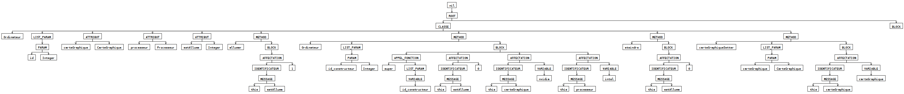
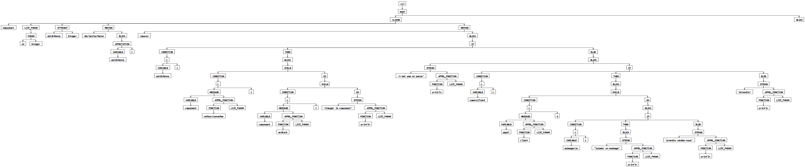
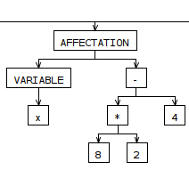
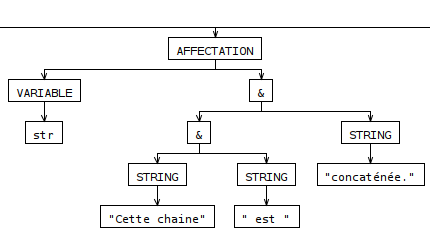
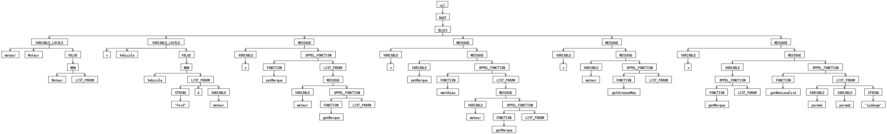

# SOUTENANCE DU PROJET COMPILATION - MERCREDI 09 DÉCEMBRE 2020

## Éléments supportés

### Les définitions de classe, constructeur, méthodes, et paramètres
Le langage BLOOD est un langage orienté objet et est donc basé sur l'utilisation de classes.  

	class Ordinateur(var id : Integer) is {
		var carteGraphique 	: CarteGraphique;
		var processeur		: Processeur;

		var estAllume		: Integer;

		def allumer() is {
			estAllume := 1;
		}

		def Ordinateur(var id_constructeur : Integer) is {
			super(id_constructeur);
			estAllume := 0;
			carteGraphique 	:= Nvidia;
			processeur := Intel;
		}

		def eteindre() is {
			estAllume := 0;
		}

		def carteGraphiqueSetter(var carteGraphique : CarteGraphique) is {
			this.carteGraphique := carteGraphique;
		}
	}

	{}
(fichier [pres_classes_1.blood](./test/pres_classes_1.blood))

L'AST obtenu est alors :

  

L'héritage est aussi supporté :

	class Composant(var id : Integer) is {

		var estEnPanne : Integer;

		def declencherPanne() is {
			estEnPanne := 1;
		}

	}

	class Processeur() extends Composant is {

		var frequence : Float;
		var nbCoeur	: Integer;
		var modele : String;

		def Processeur(id : Integer, f : Float, nc : Integer, m : String) is {
			frequence 	:= f;
			nbCoeur 	:= nc;
			modele		:= m;
		}

	}

	class RAM() extends Composant is {

		var capacite 	: Integer;
		var type		: String;

		var static nbBarrettes : Integer;

		def RAM(id : Integer, c : Integer, t : String) is {
			capacité := c;
			type := t;

			nbBarettes := nbBarettes + 1;
		}

		def static getNbBarrettes() : Integer := nbBarrettes

	}

	{}

(fichier [pres_classes_2.blood](./test/pres_classes_2.blood))

On peut remarquer plusieurs choses :
 - Les différentes méthodes de déclaration d'attributs sont utilisées (en utilisant `var` dans le constructeur de la classe ou dans le corps de la classe)
 - Le mot-clé `static` est supporté aussi bien pour les méthodes que pour les attributs
 - Les deux façons de déclarer des méthodes sont utilisées (forme se terminant par une expression et forme avec `is {...}` pour du code plus complexe)

### Structure conditionnelles et structure de boucle
L'implémentation des structures conditionnelles `if ... else ... ` et des structures de boucles `while...do...` sont supportées. Exemple :

	class Composant(var id : Integer) is {

	var estEnPanne : Integer;

	def declencherPanne() is {
		estEnPanne := 1;
	}

	def reparer() is {
		if estEnPanne = 1 then {
			while composant.neFonctionnePas() = 1 do
				while composant.enStock() = 1 do
					"changer le composant".println();

		}

		else {

			"n'est pas en panne".println();
			if numeroClient = 1 then {
				while appel.client() = 0 do {
					if messagerie = 1 then {
						"laisser un message".println();
					}
					else
						"prendre rendez-vous".println();
				}

			}
			else
				"attendre".println();
		}
	}

	}
	{}

(fichier [pres_ifwhile.blood](./test/pres_ifwhile.blood))

L'AST obtenu est alors :

  

On peut profiter de cet exemple pour voir le support des chaînes de caractères.

### Opérateurs arithmétiques et concaténation de chaînes de caractères
Les opérateurs arithmétiques et leurs priorités sont supportés. Exemple :

	{
		x : Integer;
		y : Integer;
		z : Integer;
		str : String;
		is
		x := (3+2)/4;
		y := 3+2/4;
		z := 1 + 2 + 3 - 4 + 5 - 6;

		x := 8 * 2 - 4;
		y := (4 * (3 + 4))/(8 + 4);
		z := x / y;

		str := "Cette chaine" & " est " & "concaténée.";
		str := "Autre exemple avec une méthode : " & c.getModelName();
	}
(fichier [pres_opalg.blood](./test/pres_opalg.blood))

L'AST affiche bien la bonne structure ; par exemple, pour la ligne `y := 3+2/4` on obtient bien:

  

De plus, on voit aussi à la fin du fichier un exemple de concaténation de chaînes de caractères. Il est également possible de concaténer une chaîne avec le résultat d'une méthode.

  

### Appel de fonction
Les appels de fonctions sont supportés, l'exemple suivant propose de nombreux cas d'utilisation:

	{
	/*constructeur  vide*/
	  moteur : Moteur := new Moteur();
	/*constructeur plusieurs arguments*/
	  v : Vehicule := new Vehicule("Ford", 4, moteur);
	  is
	  v.setMarque(moteur.getMarque());
	/*appel sur un attribut*/
	  v.moteur.getVitesseMax();
	/*appel de fonction multiple*/
	  v.getMarque().getNationalite();
	}
(fichier [pres_appel_fonction.blood](./test/pres_appel_fonction.blood))

L'AST obtenu est: 

  

On peut voir également que les commentaires sont supportés.

### Bloc principal et instanciation
Les fichiers `.blood` doivent contenir un bloc de code équivalent à une fonction `main`, en plus d'éventuelles classes avant ou après ce bloc. Voici un exemple dans lequel seul le bloc est implémenté.

	{
		ordi : Ordinateur := new Ordinateur(0);
		cg : CarteGraphique := new CarteGraphique(0);
		proc : Processeur := new Processeur(1, 4, 4, "i5");
		ram1 : RAM := new RAM(2, 4, "DDR4");
		ram2 : RAM := new RAM(3, 4, "DDR4");
		is

		ordi.allumer();

		if proc.estEnPanne() = 1 then
			"Le processeur est en panne !".println();
		else
			"Le processeur fonctionne".println();

		while ram2.estEnPanne() = 1 do
			"La RAM est en panne. Merci de réparer.".println();

	}
(fichier [pres_main.blood](./test/pres_main.blood))

Dans la partie définition de variables, avant le `is`, se trouve aussi deux exemples d'instanciation avec le mot-clé `new`.

### Fichier de test
Le fichier de test donné sur Arche (`exempleProgramme.pdf`) a été implémenté ([exempleProgramme.blood](./test/exempleProgramme.blood)) et est reconnu dans son intégralité.
